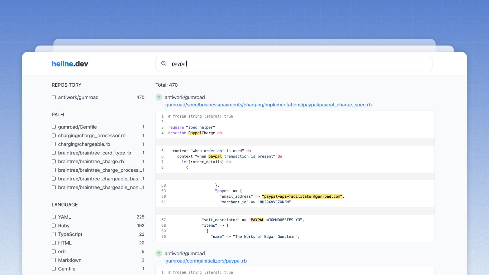

<h1 align="center"> Heline.dev </h1>
<p align="center">
    Code search for modern Developers.
</p>

<p align="center">
    
</p>

## Requirements

- rust
- golang
- nodejs >= 18
- java >= 8

## Development

Run script build to run dev mode locally.

```bash
bash build.sh
```

Install required dependencies.

```bash
bash scripts/bootstrap.sh
```

Start solr

```bash
bash scripts/solr.sh start
```

Prepare solr index

```bash
bash scripts/solr.sh prepare
```

Run production mode

```bash
bash scripts/run.sh production
```

Reset production mode - this will delete the ES data and run the indexer.

```bash
bash scripts/run.sh reset
```
